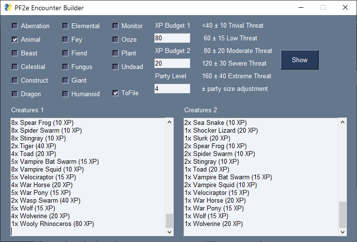

# PF2e Encounter Generator

This gui application is designed for the Pathfinder 2nd edition game system and creates a list of suitable monsters for a given encounter budget. The list of monsters is read from a table (2eMonsters.ods). Monster data is copied from [Archives of Nethys](https://2e.aonprd.com/Creatures.aspx) (OGL licensed).

